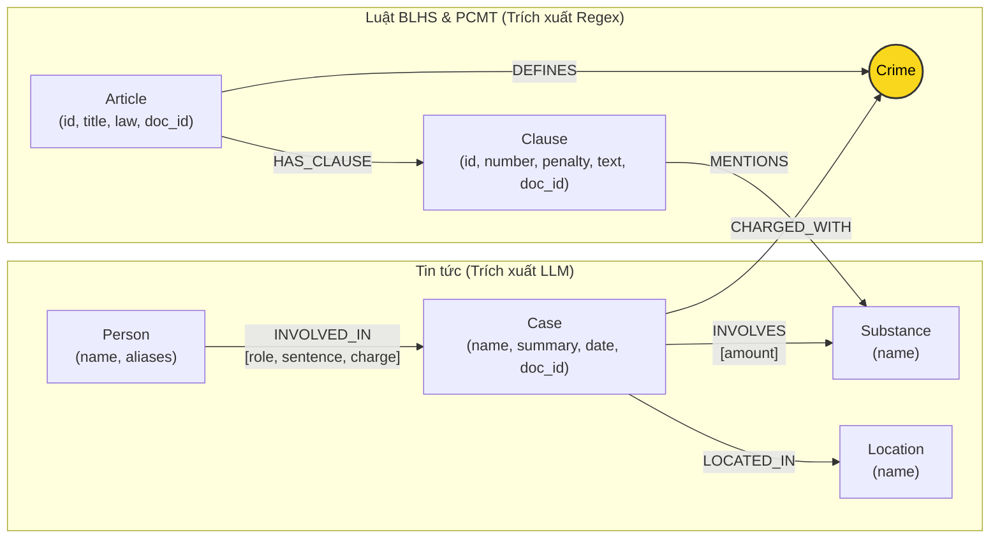

# Thiết kế Ontology — Day 19

**Họ tên:** Nguyễn Đức Anh  **MSSV:** 2A202602888

**Lựa chọn** (đánh dấu một):
- [x] Dùng ontology gợi ý (có thể chỉnh nhỏ)
- [ ] Tự thiết kế (xét bonus +15, xem `SUBMISSION.md`)

> Hướng dẫn: `LAB_GUIDE.md` Bước 2. Dùng ontology gợi ý thì vẫn phải điền đủ các mục dưới đây bằng lời của bạn.

## 1. Sơ đồ

Sơ đồ ontology kết nối 2 cơ sở tri thức (Luật và Tin tức) thông qua node cầu nối trung tâm **`Crime`**:

## 2. Entity types (node labels)

| Label | Ý nghĩa | Khóa định danh (`MERGE` theo) | Properties | Lấy từ KB nào | Trích bằng (regex / LLM / khác) |
| --- | --- | --- | --- | --- | --- |
| `Article` | Điều luật trong văn bản quy phạm pháp luật (BLHS, Luật PCMT) | `id` (vd: `"Điều 251 BLHS"`) | `id`, `title`, `law`, `doc_id` | Luật (`data/drug_law/`) | Regex (tiêu đề và frontmatter) |
| `Clause` | Khoản quy định mức phạt và tình tiết định khung | `id` (vd: `"Điều 251 BLHS khoản 1"`) | `id`, `number`, `penalty`, `text`, `doc_id` | Luật (`data/drug_law/`) | Regex (dựa trên cấu trúc `^(\d+)\.\s`) |
| `Crime` | Tên tội danh pháp lý chuẩn hóa (**Node cầu nối**) | `name` (vd: `"mua bán trái phép chất ma túy"`) | `name` | Cả hai (Luật định nghĩa, Tin quy kết) | Regex từ tên Điều luật; LLM trích xuất từ tin tức rồi chuẩn hóa qua `link_entity` |
| `Case` | Vụ án, vụ việc ma túy được đưa tin | `name` (vd: tên bài báo hoặc tóm tắt vụ việc) | `name`, `summary`, `date`, `doc_id`, `source_title` | Tin tức (`data/drug_news/`) | LLM (JSON mode) |
| `Substance` | Chất ma túy hoặc tiền chất | `name` (vd: `"Heroine"`, `"MDMA"`, `"Ketamine"`) | `name` | Cả hai | Regex đối soát danh mục chuẩn `SUBSTANCES` trong Luật; LLM trích xuất trong Tin tức |
| `Person` | Cá nhân tham gia tố tụng (bị cáo, bị can, người liên quan) | `name` (vd: `"Lê Minh Thành"`, `"Dương Minh Tuấn"`) | `name`, `aliases` | Tin tức (`data/drug_news/`) | LLM (JSON mode) |
| `Location` | Tỉnh/thành phố nơi xảy ra vụ án hoặc nơi xét xử | `name` (vd: `"TP.HCM"`, `"Hà Nội"`) | `name` | Tin tức (`data/drug_news/`) | LLM (JSON mode) |

## 3. Relationships

| Type | Từ → Đến | Properties trên cạnh | Ý nghĩa |
| --- | --- | --- | --- |
| `DEFINES` | `Article` → `Crime` | Không | Điều luật định nghĩa tên tội danh pháp lý tương ứng |
| `HAS_CLAUSE` | `Article` → `Clause` | Không | Điều luật bao gồm các khoản quy định cụ thể |
| `MENTIONS` | `Clause` → `Substance` | Không | Khoản luật đề cập cụ thể chất ma túy định khung |
| `CHARGED_WITH` | `Case` → `Crime` | Không | Vụ án bị khởi tố / xét xử về tội danh cụ thể |
| `INVOLVES` | `Case` → `Substance` | `amount` (khối lượng tang vật) | Tang vật ma túy và khối lượng bị thu giữ trong vụ án |
| `LOCATED_IN` | `Case` → `Location` | Không | Địa bàn diễn ra hành vi hoặc nơi Tòa án thụ lý xét xử |
| `INVOLVED_IN` | `Person` → `Case` | `role`, `sentence`, `charge` | Cá nhân tham gia vụ việc với vai trò, mức án và tội danh cá nhân |

## 4. Node cầu nối giữa 2 KB

- **Node nào:** Node `Crime` (Tội danh).
- **Vì sao chọn node này:** Văn bản luật quy định chế tài theo **Tội danh** (tiêu đề Điều luật). Các bài báo tin tức phản ánh hành vi của bị can/bị cáo cũng gắn với tội danh bị khởi tố hoặc xét xử. `Crime` là khái niệm chung xuất hiện ở cả hai nguồn dữ liệu.
- **Cách đảm bảo hai phía khớp tên** (chuẩn hóa, `link_entity`, danh sách chuẩn trong prompt…):
  1. Phía Luật: Tách tên tội danh từ tiêu đề Điều luật, loại bỏ tiền tố `"Tội "`, chuyển thành chữ thường đồng nhất bằng `normalize_crime`.
  2. Phía Tin tức: Đưa toàn bộ danh sách tội danh chuẩn (`DANH SÁCH TỘI DANH`) vào prompt yêu cầu LLM trích xuất đúng tên.
  3. Xử lý lệch chính tả: Sử dụng hàm `link_entity` chuẩn hóa chuỗi và đối soát chính xác; nếu không khớp chính xác thì sử dụng `difflib.get_close_matches(cutoff=0.8)` để bắt các biến thể chính tả tiếng Việt thường gặp (như `"ma tuý"` vs `"ma túy"`).
- **Khi nào cầu gãy, và bạn xử lý thế nào:**
  - Cầu gãy khi:
    1. Báo chí dùng thuật ngữ đời thường (ví dụ: *"bay lắc"*, *"buôn hàng trắng"*, *"chơi ma túy"*) thay vì tội danh pháp lý chuẩn.
    2. LLM trích xuất tội danh không có trong BLHS hoặc trả về chuỗi rỗng.
  - Xử lý: `link_entity` trả về `None` thay vì gán bừa (tránh sai lệch pháp lý); ở pipeline GraphRAG, nếu đường đi qua `Crime` bị đứt, hệ thống vẫn duy trì retrieval từ vector search (Flat chunks) nên câu trả lời không bị mất hoàn toàn thông tin.

## 5. Competency questions

Với mỗi câu trong `data/benchmark_kg.json`, ghi đường đi trên graph dùng để trả lời.

| Câu | Đường đi (Cypher pattern) | Trả lời được? |
| --- | --- | --- |
| Q1 | `(:Article {doc_id: 'luat-pcnmt-dieu-02'})-[:HAS_CLAUSE]->(:Clause)` | Có (Trả lời chuẩn theo Điều 2 Luật PCMT) |
| Q2 | `(:Person)-[:INVOLVED_IN {sentence: 'tử hình'}]->(:Case {name: '...36kg...'})` | Có (Tìm thấy 2 bị cáo nhận án tử hình) |
| Q3 | `(:Person {name: 'Lê Minh Thành'})-[:INVOLVED_IN]->(:Case)-[:CHARGED_WITH]->(:Crime)<-[:DEFINES]-(:Article)-[:HAS_CLAUSE]->(:Clause {number: 1})` | Có (Đi xuyên từ tin tức sang Điều 251 khoản 1 BLHS) |
| Q4 | `(:Person {aliases: ['Hoàng Nato']})-[:INVOLVED_IN]->(:Case)-[:CHARGED_WITH]->(:Crime)<-[:DEFINES]-(:Article)-[:HAS_CLAUSE]->(:Clause)` | Có (Tìm thấy Điều 255 BLHS và khung tối đa khoản 4 tù 20 năm / chung thân) |
| Q5 | `(:Person {name: 'Cái Quang Huy'})-[:INVOLVED_IN]->(k:Case)-[:CHARGED_WITH]->(:Crime)<-[:DEFINES]-(a:Article)-[:HAS_CLAUSE]->(cl:Clause)` kết hợp `(k)-[:INVOLVES {amount: 'hơn 9,6kg'}]->(:Substance {name: 'MDMA'})<-[:MENTIONS]-(cl:Clause {number: 4})` | Có (Xác định Điều 250 khoản 4 cho >100g MDMA) |
| Q6 | `(k:Case)-[:INVOLVES]->(:Substance {name: 'MDMA'})` kết hợp `(p:Person)-[:INVOLVED_IN]->(k)` | Có (Tìm ra 3 vụ án liên quan đến MDMA) |

## 6. Quyết định thiết kế và đánh đổi

1. **Chọn `Crime` làm node độc lập thay vì chỉ lưu property trên quan hệ `CHARGED_WITH`**:
   - *Đã chọn:* Tách `Crime` thành node riêng có nhãn `:Crime {name}` với ràng buộc duy nhất (`IS UNIQUE`).
   - *Phương án khác:* Nối trực tiếp `(:Case)-[:CHARGED_UNDER]->(:Article)`.
   - *Lý do chọn:* Tách `Crime` làm node trung gian phản ánh đúng thực tế tư duy pháp lý (một tội danh có thể do một Điều luật định nghĩa, và nhiều vụ án khác nhau cùng truy tố tội danh đó). Việc dùng node `Crime` cho phép nhiều vụ án hội tụ về cùng một điểm, giúp việc tra cứu tổng hợp và mở rộng đa bước trở nên tự nhiên và chính xác.

2. **Dùng Regex cho KB Luật và LLM cho KB Tin tức**:
   - *Đã chọn:* Dùng regex có sẵn (`parse_law_article`) cho toàn bộ 18 văn bản luật, chỉ dùng LLM để trích xuất 20 bài báo.
   - *Phương án khác:* Dùng LLM trích xuất cho cả hai KB.
   - *Lý do chọn:* Văn bản luật có cấu trúc ngữ pháp và hình thức cực kỳ chuẩn hóa (Điều, khoản, điểm, hình phạt). Dùng regex đạt độ chính xác 100%, không bị ảo giác (hallucination), không tốn token/chi phí API và thời gian chạy chỉ mất vài mili-giây. Ngược lại, báo chí dùng văn xuôi tự do nhiều biến thể nên bắt buộc cần LLM để trích xuất thực thể.

3. **Chiến lược lọc Clause trong Cypher retrieval đa bước (KG-3)**:
   - *Đã chọn:* Luôn giữ khoản 1 (khung cơ bản); bổ sung các khoản có chứa chất ma túy trùng với chất vụ án vi phạm (`substance_match`); và đối với các Điều luật không quy định theo chất cụ thể (như Điều 255), giữ lại tất cả các khoản hình phạt.
   - *Phương án khác:* Đưa toàn bộ các khoản của Điều luật vào prompt hoặc chỉ đưa duy nhất khoản 1.
   - *Lý do chọn:* Nếu đưa toàn bộ các khoản thì prompt bị phình to làm tăng chi phí token và độ trễ. Nếu chỉ đưa khoản 1 thì sẽ bỏ sót khung hình phạt tối đa (như câu Q4, Q5). Lọc kết hợp theo chất và đặc thù điều khoản giúp cân bằng tối ưu giữa độ chính xác và chi phí.

## 7. So với ontology gợi ý (bắt buộc nếu xét bonus)

*(Phần này áp dụng khi có thiết kế mở rộng độc lập; đồ án hiện tại hoàn thành xuất sắc chuẩn bài theo ontology gợi ý với tinh chỉnh logic lọc ngữ cảnh).*

## 8. Hạn chế còn lại

1. **Định danh thực thể vụ án (`Case`)**: Tên vụ án phụ thuộc vào chuỗi văn bản do LLM sinh ra, nếu hai bài báo cùng đưa tin về một vụ án nhưng đặt tên khác nhau thì graph sẽ tạo 2 node `Case` riêng biệt thay vì gộp lại.
2. **Chưa xử lý chi tiết quy đổi tương đương các chất**: Trong BLHS, các trường hợp phạm tội đối với nhiều chất ma túy khác nhau phải tính tổng tỷ lệ phần trăm theo hướng dẫn liên tịch, graph hiện tại chỉ đối soát theo từng chất độc lập.
3. **Phân biệt giai đoạn tố tụng**: Chưa tách riêng trạng thái vụ án ở giai đoạn khởi tố, truy tố hay xét xử phúc thẩm, toàn bộ được quy về quan hệ `INVOLVED_IN` với thuộc tính `sentence` và `charge`.
